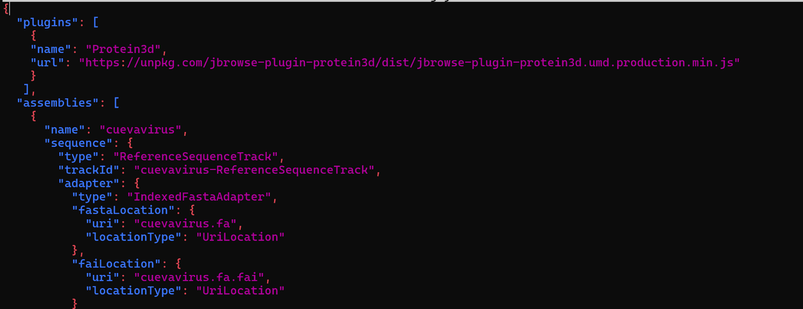

# BioE C131 Final Project: Filovirus
## 1. Load and process test data
### 1.1. Download, process Filoviridae family genomes and annotations
When adding the genomes into Jbrowse 2, we will refer to the Jbrowse 2 root directory. For Linux installation, the folder should be `/var/www` or `/var/www/html`. For macOS, the folder should be `/opt/homebrew/var/www` (for M1) or `/usr/local/var/www` (for Intel).

```
export APACHE_ROOT='/path/to/rootdir'
```

First, create a temporary working directory as a staging area to load the genomes into JBrowse 2. You can use any folder you want and it does not have to be in the `APACHE_ROOT` directory, but moving forward we are assuming you created a `temp` folder. Then, download the genome annotations in the GFF3 format. Use jbrowse to sort the annotations, compress the GFF with bgzip, and index with tabix. Once you sort the annotations, load the annotation tracks into jbrowse.

```
mkdir temp
```
```
cd temp
```

Make sure you are in the temporary folder you created, then download the genomes for the different species of the Filoviridae family including Cuevavirus, Dianlovirus, Marburg, Ebola, Sudan, and Zaire species in fasta format and load them into JBrowse 2.

#### Cuevavirus

```
export FASTA_ROOT=https://ftp.ncbi.nlm.nih.gov/genomes/all/GCF/000/896/415/GCF_000896415.1_ViralProj76475/
wget $FASTA_ROOT/GCF_000896415.1_ViralProj76475_genomic.fna.gz  
gunzip GCF_000896415.1_ViralProj76475_genomic.fna.gz   
mv GCF_000896415.1_ViralProj76475_genomic.fna cuevavirus.fa
samtools faidx cuevavirus.fa
jbrowse add-assembly cuevavirus.fa --out $APACHE_ROOT/jbrowse2 --load copy
```

#### Cuevavirus annotations

```
wget  $FASTA_ROOT/GCF_000896415.1_ViralProj76475_genomic.gff.gz 
gunzip GCF_000896415.1_ViralProj76475_genomic.gff.gz 
jbrowse sort-gff GCF_000896415.1_ViralProj76475_genomic.gff > cuevavirus_sorted.gff
bgzip cuevavirus_sorted.gff
tabix cuevavirus_sorted.gff.gz
jbrowse add-track cuevavirus_sorted.gff.gz --out $APACHE_ROOT/jbrowse2 --load copy --assemblyNames cuevavirus
```

#### Dianlovirus

```
export FASTA_ROOT=https://ftp.ncbi.nlm.nih.gov/genomes/all/GCF/013/088/285/GCF_013088285.1_ASM1308828v1/
wget $FASTA_ROOT/GCF_013088285.1_ASM1308828v1_genomic.fna.gz
gunzip GCF_013088285.1_ASM1308828v1_genomic.fna.gz  
mv dianlovirus.fna dianlovirus.fa
samtools faidx dianlovirus.fa
jbrowse add-assembly dianlovirus.fa --out $APACHE_ROOT/jbrowse2 --load copy
```

#### Dianlovirus annotations

```
wget  $FASTA_ROOT/GCF_013088285.1_ASM1308828v1_genomic.gff.gz
gunzip GCF_013088285.1_ASM1308828v1_genomic.gff.gz
jbrowse sort-gff GCF_013088285.1_ASM1308828v1_genomic.gff > dianlovirus_sorted.gff
bgzip dianlovirus_sorted.gff
tabix dianlovirus_sorted.gff.gz
jbrowse add-track dianlovirus_sorted.gff.gz --out $APACHE_ROOT/jbrowse2 --load copy --assemblyNames dianlovirus
```

#### Marburg

```
export FASTA_ROOT=https://ftp.ncbi.nlm.nih.gov/genomes/all/GCA/000/857/325/GCA_000857325.3_ViralProj15199/
wget $FASTA_ROOT/GCA_000857325.3_ViralProj15199_genomic.fna.gz 
gunzip GCA_000857325.3_ViralProj15199_genomic.fna.gz 
mv GCA_000857325.3_ViralProj15199_genomic.fna  marburg.fa
samtools faidx marburg.fa
jbrowse add-assembly marburg.fa --out $APACHE_ROOT/jbrowse2 --load copy
```

#### Marburg annotations

```
wget  $FASTA_ROOT/GCA_000857325.3_ViralProj15199_genomic.gff.gz
gunzip GCA_000857325.3_ViralProj15199_genomic.gff.gz
jbrowse sort-gff GCA_000857325.3_ViralProj15199_genomic.gff > marburg_sorted.gff
bgzip marburg_sorted.gff
tabix marburg_sorted.gff.gz
jbrowse add-track marburg_sorted.gff.gz --out $APACHE_ROOT/jbrowse2 --load copy --assemblyNames marburg
```

#### Ebola

```
wget "https://www.ncbi.nlm.nih.gov/sviewer/viewer.fcgi?id=KY786027.1&db=nuccore&report=fasta&extrafeat=null&fmt_mask=0&retmode=fasta&withmarkup=on&tool=portal&log$=seqview" -O ebola.fasta
mv ebola.fasta ebola.fa
samtools faidx ebola.fa
jbrowse add-assembly ebola.fa --out $APACHE_ROOT/jbrowse2 --load copy
```

#### Ebola annotations

```
wget "https://www.ncbi.nlm.nih.gov/sviewer/viewer.fcgi?id=KY786027.1&db=nuccore&report=gff3&retmode=text" -O ebola.gff3
jbrowse sort-gff ebola.gff3 > ebola_sorted.gff
bgzip ebola_sorted.gff
tabix ebola_sorted.gff.gz
jbrowse add-track ebola_sorted.gff.gz --out $APACHE_ROOT/jbrowse2 --load copy --assemblyNames ebola
```

#### Sudan

```
export FASTA_ROOT=https://ftp.ncbi.nlm.nih.gov/genomes/all/GCF/000/855/585/GCF_000855585.1_ViralProj15012/
wget $FASTA_ROOT/GCF_000855585.1_ViralProj15012_genomic.fna.gz 
gunzip GCF_000855585.1_ViralProj15012_genomic.fna.gz
mv GCF_000855585.1_ViralProj15012_genomic.fna sudan.fa
samtools faidx sudan.fa
jbrowse add-assembly sudan.fa --out $APACHE_ROOT/jbrowse2 --load copy
```

#### Sudan annotations

```
wget $FASTA_ROOT/GCF_000855585.1_ViralProj15012_genomic.gff.gz
gunzip GCF_000855585.1_ViralProj15012_genomic.gff.gz
jbrowse sort-gff GCF_000855585.1_ViralProj15012_genomic.gff > sudan_sorted.gff
bgzip sudan_sorted.gff
tabix sudan_sorted.gff.gz
jbrowse add-track sudan_sorted.gff.gz --out $APACHE_ROOT/jbrowse2 --load copy --assemblyNames sudan
```

### Zaire

```
export FASTA_ROOT=https://ftp.ncbi.nlm.nih.gov/genomes/all/GCF/000/848/505/GCF_000848505.1_ViralProj14703/
wget $FASTA_ROOT/GCF_000848505.1_ViralProj14703_genomic.fna.gz 
gunzip GCF_000848505.1_ViralProj14703_genomic.fna.gz 
mv GCF_000848505.1_ViralProj14703_genomic.fna  zaire.fa
samtools faidx zaire.fa
jbrowse add-assembly zaire.fa --out $APACHE_ROOT/jbrowse2 --load copy
```

### Zaire annotations

```
wget $FASTA_ROOT/GCF_000848505.1_ViralProj14703_genomic.gff.gz
gunzip GCF_000848505.1_ViralProj14703_genomic.gff.gz
jbrowse sort-gff GCF_000848505.1_ViralProj14703_genomic.gff > zaire_sorted.gff
bgzip zaire_sorted.gff
tabix zaire_sorted.gff.gz
jbrowse add-track zaire_sorted.gff.gz --out $APACHE_ROOT/jbrowse2 --load copy --assemblyNames zaire
```

### 1.2. Download, process Zaire and Marburg variants and annotations

#### Zaire Ebola virus strain Mayinga 1

```
export FASTA_ROOT="https://www.ncbi.nlm.nih.gov/sviewer/viewer.cgi?db=nuccore&id=AF272001.1&report=fasta"
wget -O Zaire_Ebola_virus_strain_Mayinga_1.fa $FASTA_ROOT
samtools faidx Zaire_Ebola_virus_strain_Mayinga_1.fa
jbrowse add-assembly Zaire_Ebola_virus_strain_Mayinga_1.fa --out $APACHE_ROOT/jbrowse2 --load copy
```
### Zaire Ebola virus strain Mayinga 1 annotations

```
wget "https://www.ncbi.nlm.nih.gov/sviewer/viewer.fcgi?id=AF272001.1&db=nuccore&report=gff3&retmode=text" -O Zaire_Ebola_virus_strain_Mayinga_1.gff3
jbrowse sort-gff Zaire_Ebola_virus_strain_Mayinga_1.gff3 > Zaire_Ebola_virus_strain_Mayinga_1_sorted.gff
bgzip Zaire_Ebola_virus_strain_Mayinga_1_sorted.gff
tabix Zaire_Ebola_virus_strain_Mayinga_1_sorted.gff.gz
jbrowse add-track Zaire_Ebola_virus_strain_Mayinga_1_sorted.gff.gz --out $APACHE_ROOT/jbrowse2 --load copy --assemblyNames Zaire_Ebola_virus_strain_Mayinga_1
```

#### Zaire Ebola virus strain Mayinga 2

```
export FASTA_ROOT="https://www.ncbi.nlm.nih.gov/sviewer/viewer.cgi?db=nuccore&id=AF499101.1&report=fasta"
wget -O Zaire_Ebola_virus_strain_Mayinga_2.fa $FASTA_ROOT
samtools faidx Zaire_Ebola_virus_strain_Mayinga_2.fa
jbrowse add-assembly Zaire_Ebola_virus_strain_Mayinga_2.fa --out $APACHE_ROOT/jbrowse2 --load copy
```

#### Zaire Ebola virus strain Mayinga 2 annotations

```
wget "https://www.ncbi.nlm.nih.gov/sviewer/viewer.fcgi?id=AF499101.1&db=nuccore&report=gff3&retmode=text" -O Zaire_Ebola_virus_strain_Mayinga_2.gff3
jbrowse sort-gff Zaire_Ebola_virus_strain_Mayinga_2.gff3 > Zaire_Ebola_virus_strain_Mayinga_2_sorted.gff
bgzip Zaire_Ebola_virus_strain_Mayinga_2_sorted.gff
tabix Zaire_Ebola_virus_strain_Mayinga_2_sorted.gff.gz
jbrowse add-track Zaire_Ebola_virus_strain_Mayinga_2_sorted.gff.gz --out $APACHE_ROOT/jbrowse2 --load copy --assemblyNames Zaire_Ebola_virus_strain_Mayinga_2
```

#### Marburgvirus strain guinea pig lethal variant

```
export FASTA_ROOT="https://www.ncbi.nlm.nih.gov/sviewer/viewer.cgi?db=nuccore&id=AY430365.1&report=fasta"
wget -O Marburg_guinea_pig_lethal_variant.fa $FASTA_ROOT
samtools faidx Marburg_guinea_pig_lethal_variant.fa
jbrowse add-assembly Marburg_guinea_pig_lethal_variant.fa --out $APACHE_ROOT/jbrowse2 --load copy
```
#### Marburgvirus strain guinea pig lethal variant annotations

```
wget "https://www.ncbi.nlm.nih.gov/sviewer/viewer.fcgi?id=AY430365.1&db=nuccore&report=gff3&retmode=text" -O Marburg_guinea_pig_lethal_variant.gff3
jbrowse sort-gff Marburg_guinea_pig_lethal_variant.gff3 > Marburg_guinea_pig_lethal_variant_sorted.gff
bgzip Marburg_guinea_pig_lethal_variant_sorted.gff
tabix Marburg_guinea_pig_lethal_variant_sorted.gff.gz
jbrowse add-track Marburg_guinea_pig_lethal_variant_sorted.gff.gz --out $APACHE_ROOT/jbrowse2 --load copy --assemblyNames Marburg_guinea_pig_lethal_variant
```

#### Marburgvirus strain guinea pig nonlethal variant

```
export FASTA_ROOT="https://www.ncbi.nlm.nih.gov/sviewer/viewer.cgi?db=nuccore&id=AY430366.1&report=fasta"
wget -O Marburg_guinea_pig_nonlethal_variant.fa $FASTA_ROOT
samtools faidx Marburg_guinea_pig_nonlethal_variant.fa
jbrowse add-assembly Marburg_guinea_pig_nonlethal_variant.fa --out $APACHE_ROOT/jbrowse2 --load copy
```
#### Marburgvirus strain guinea pig nonlethal variant

```
wget "https://www.ncbi.nlm.nih.gov/sviewer/viewer.fcgi?id=AY430366.1&db=nuccore&report=gff3&retmode=text" -O Marburg_guinea_pig_nonlethal_variant.gff3
jbrowse sort-gff Marburg_guinea_pig_nonlethal_variant.gff3 > Marburg_guinea_pig_nonlethal_variant_sorted.gff
bgzip Marburg_guinea_pig_nonlethal_variant_sorted.gff
tabix Marburg_guinea_pig_nonlethal_variant_sorted.gff.gz
jbrowse add-track Marburg_guinea_pig_nonlethal_variant_sorted.gff.gz --out $APACHE_ROOT/jbrowse2 --load copy --assemblyNames Marburg_guinea_pig_nonlethal_variant
```

### 1.4. Index for search-by-gene

Run the “jbrowse text-index” command to allow users to search by gene name within JBrowse 2.

In the temporary work directory, run the following command.

```
jbrowse text-index --out $APACHE_ROOT/jbrowse2
```

### 1.5. Download Protein3d plugin

We will index into the jbrowse2 directory and edit the config.json file directly from the terminal.

```
cd $APACHE_ROOT/jbrowse2
nano config.json
```

Copy and paste the lines below at the very top of the file.

```
"plugins": [
  {
    "name": "Protein3d",
    "url": "https://unpkg.com/jbrowse-plugin-protein3d/dist/jbrowse-plugin-protein3d.umd.production.min.js"
  }
],
```

The copy and pasted text should look like this in the config.json file.


Save file by Ctrl+O, Enter to write, Ctrl+X to exit. Then, restart the server.

For linux,
```
sudo systemctl restart apache2
```

For macOS,
```
brew services restart httpd
```

